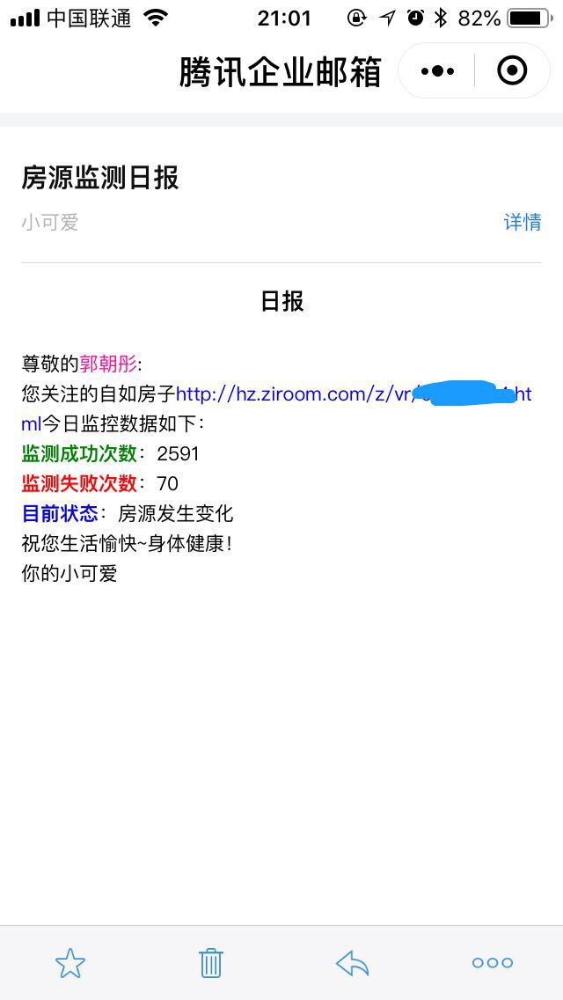

# 自动监控自如房子能不能预订

女票想租房，但是抢不到好的，于是自动监控一下，一旦能预订就马上通知她，给她一个惊喜。
## 技术点

- 阿里云“邮件推送”，每日免费200封
- SpringBoot && EnableScheduling
- JPA && H2

##  如何监控变化

因为房展没有明确的标识现在房子的状态，只有一个图片显示是否在配置还是可预订。所以，主要是根据一个细节，那个图片的url有没有变化。233333333.

## 其他细节

主要的配置都是通过配置文件读进来的，避免下次换房子或别人换房子能立刻改代码。

核心的涉密的我再传到github后全部改成了xxxxx，避免邮箱地址和阿里云邮件推送服务的秘钥泄露。

## 效果图

### 1. 加入房源检测，给她一个惊喜

### 2. 每日日报，其实也就运行了一天就找到了房子

### 3. 找到房子后
